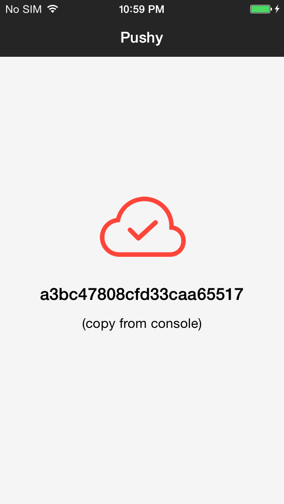
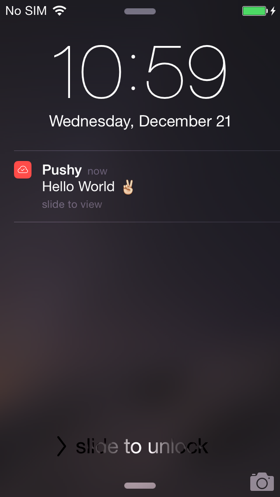
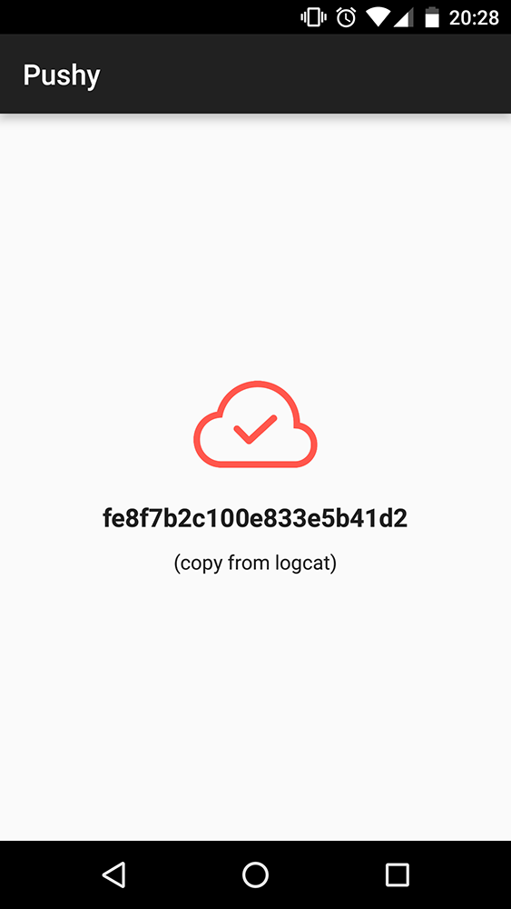
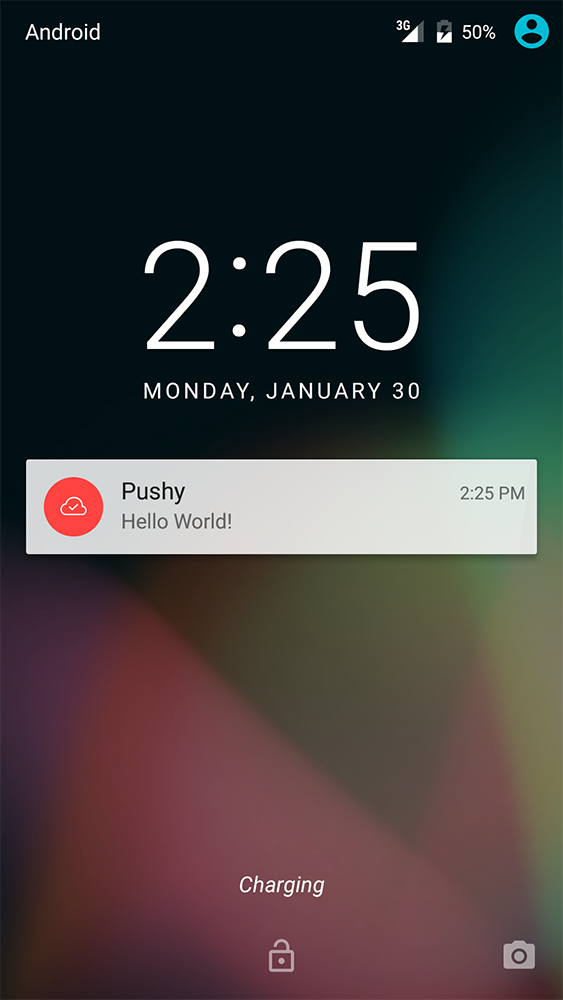

# pushy-demo-expo

A demo of the [Pushy SDK for React Native](https://github.com/pushy/pushy-react-native) integrated into a sample Expo app.

> [Pushy](https://pushy.me/) is the most reliable platform for time-critical, worldwide push notification delivery.

This app registers your device to receive push notifications and assigns it a unique token, which you can copy and paste into the [demo page](https://pushy.me/docs/resources/demo) to send yourself a test push notification on both Android and iOS.

Visit our documentation to [integrate Pushy into your existing React Native / Expo app](https://pushy.me/docs/additional-platforms/react-native).

## Screenshots

#### iOS

  

#### Android

 

## Get Started

* First, ensure you have a healthy React Native installation by running `npx expo-doctor` and fixing any issues reported
* Clone the repository locally: `git clone https://github.com/pushy/pushy-demo-expo.git`
* Run `cd pushy-demo-expo`
* Run `npm install` to install the React Native / Expo dependencies
* For Android, run `npx expo run:android` to run the app on either an emulator or a connected Android device
* For iOS, run `npx expo run:ios` to run the app on either an emulator or a connected iOS device
* Copy the device token from the Metro dev server console and paste it into the [demo page](https://pushy.me/docs/resources/demo) to send yourself a test notification

## More Information

* [Pushy](https://pushy.me/)
* [Pricing](https://pushy.me/pricing)
* [Documentation](https://pushy.me/docs)

## License

[Apache 2.0](LICENSE)
